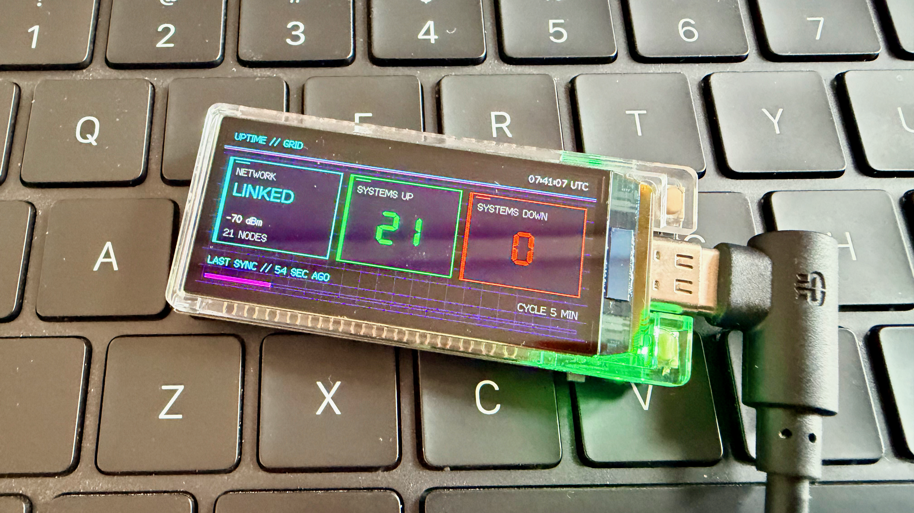

## Uptime monitor for LilyGo AMOLED

Uptime LilyGo turns a LilyGo T-Display-S3 AMOLED into a compact Wi-Fi uptime
dashboard. It checks configured HTTP and HTTPS endpoints on a schedule and shows
network strength, systems up, systems down, UTC time, and time since last scan.



## Features

* Dashboard orientation for USB-right, USB-left, USB-down, or USB-up mounting
* Multiple HTTP and HTTPS endpoint checks
* HTTP status codes from 200 through 399 treated as healthy
* Configurable refresh interval and display brightness
* Wi-Fi reconnect handling
* UTC clock synchronized through NTP
* LittleFS configuration, keeping credentials outside firmware source
* Cyberpunk-inspired status display with scan progress

## Hardware

* [LilyGo T-Display-S3 AMOLED](https://www.lilygo.cc/products/t-display-s3-amoled)
* USB-C data cable
* 2.4 GHz Wi-Fi network

Target hardware uses an ESP32-S3, 16 MB flash, 8 MB OPI PSRAM, and RM67162
AMOLED panel. A custom PlatformIO board definition is included in
`boards/T-Display-AMOLED.json`.

## Prerequisites

Install [Visual Studio Code](https://code.visualstudio.com/) with the
[PlatformIO IDE extension](https://platformio.org/install/ide?install=vscode),
or install [PlatformIO Core](https://docs.platformio.org/en/latest/core/installation/index.html).

Dependencies are downloaded automatically from `platformio.ini` during the
first build.

## Configuration

Create your local configuration from the sample:

```bash
cp data/settings.ini.sample data/settings.ini
```

Edit `data/settings.ini`:

```ini
[wifi]
ssid = your-wifi-name
password = your-wifi-password

[sites]
Example = https://example.com
Local Service = http://192.168.1.10:8080/health

[config]
refresh_minutes = 5
display_brightness_percent = 75
orientation = right
```

Each entry under `[sites]` uses `Display Name = URL` format. At least one site
and a Wi-Fi SSID are required. `refresh_minutes` accepts 1 through 1440, and
`display_brightness_percent` accepts 0 through 100. `orientation` accepts
`right`, `left`, `down`, or `up`, based on the USB port position. It defaults to
`right`. Portrait orientations preserve the dashboard composition and rotate
the network, systems-up, and systems-down panels so their contents stay upright.

`data/settings.ini` is excluded from Git so Wi-Fi credentials and private URLs
are not committed.

> [!WARNING]
> HTTPS checks currently skip certificate verification. Use this project for
> availability monitoring only, not for validating endpoint identity or
> transporting sensitive data.

## Build and flash

Connect the board over USB-C, then build and upload firmware:

```bash
pio run
pio run --target upload
```

Upload the LittleFS configuration separately:

```bash
pio run --target uploadfs
```

PlatformIO normally detects the serial port automatically. Specify one when
needed:

```bash
pio run --target upload --upload-port /dev/cu.usbmodem1101
pio run --target uploadfs --upload-port /dev/cu.usbmodem1101
```

After a firmware-only change, upload firmware. After changing
`data/settings.ini`, upload LittleFS. Upload both for a fresh board.

## Run tests

Run host-side unit tests without connecting the board:

```bash
pio test -e native
```

Tests cover HTTP health classification, status counts and transitions,
orientation mapping, brightness conversion, refresh boundaries, and `millis()`
rollover behavior.

## Monitor serial output

Open the serial monitor at 115200 baud:

```bash
pio device monitor
```

## Project structure

```text
boards/                  Custom PlatformIO board definition
data/settings.ini.sample Public configuration template
lib/UptimeCore/           Hardware-independent behavior
media/                   Project images
src/main.cpp             Firmware and dashboard implementation
test/test_uptime_core/    Native Unity tests
platformio.ini           Build, dependency, and upload configuration
```

## License

Released under the [MIT License](LICENSE).
